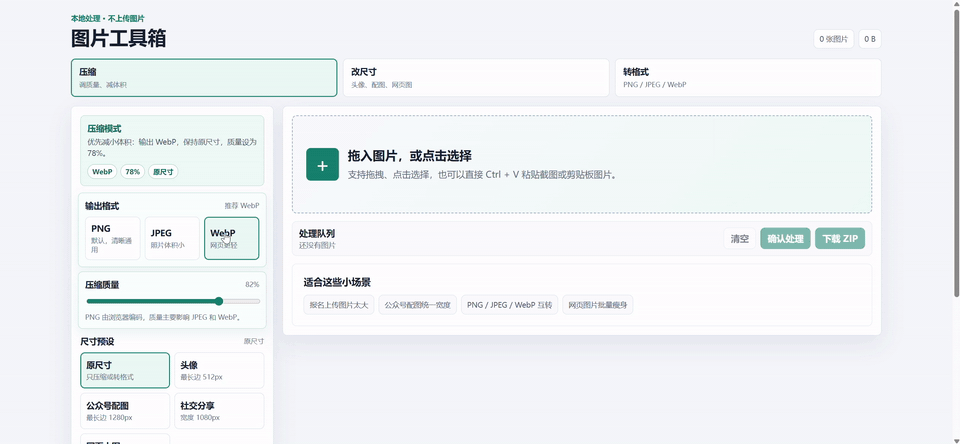

# Image Toolbox 图片工具箱

一个纯前端、本地处理的图片小工具，支持批量压缩、改尺寸、转格式和 ZIP 下载。适合上传报名照、公众号配图、网页图片瘦身、PNG / JPEG / WebP 转换等日常场景。

## 演示



## 功能

- 多图拖拽/点击上传
- 默认输出 PNG，也可切换 JPEG / WebP
- 支持压缩质量调节
- 支持原尺寸、最长边、指定宽度、指定高度等比缩放
- 内置头像、公众号配图、社交分享、网页小图预设
- 展示原图大小、输出大小、尺寸、压缩率和处理状态
- 支持单张下载和全部 ZIP 下载
- 图片只在浏览器本地处理，不上传服务器

## 本地运行

```bash
npm install
npm run dev
```

## 构建

```bash
npm run build
```

`dist/` 可部署到 GitHub Pages、Vercel、Netlify 或任意静态站点服务。
